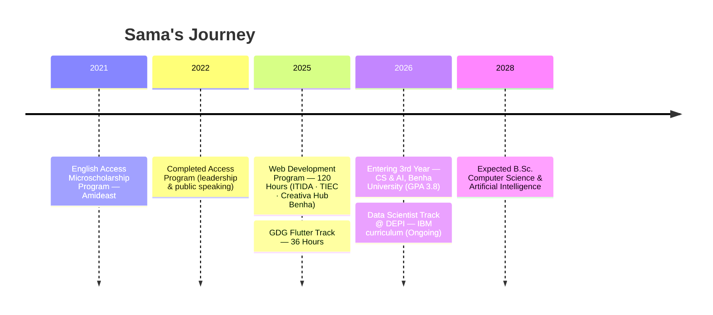

<!-- ═══════════════════════════════════════════════════════════
     SAMA DAWOOD · README.md · v3.0 — NEURAL CORE EDITION
     Data Science & AI · CS & AI Student · Benha University
     Palette: void #050814 · cyan #22d3ee · violet #a855f7 · mint #34d399
     NOTE: replace SamaDawood with your real GitHub username
     ═══════════════════════════════════════════════════════════ -->

<a name="top"></a>

<div align="center">


<a href="https://linkedin.com/in/sama-dawood-160104344">
  
</a>

<p>
  
  
  
  
</p>

<p>
  <a href="#-boot-sequence">✦ About</a> ·
  <a href="#-core-stack">⚡ Stack</a> ·
  <a href="#-certifications--training">🎓 Training</a> ·
  <a href="#-training-timeline">🛰️ Timeline</a> ·
  <a href="#-telemetry">📈 Stats</a> ·
  <a href="#-uplink">📮 Contact</a>
</p>

</div>


## ✦ Boot Sequence

> _"Turning data into meaningful insights."_

Driven **Computer Science & Artificial Intelligence** student (entering 3rd year) at **Benha University**, building a strong foundation in **Python for data analysis** (NumPy, Pandas) while pursuing **IBM's Data Scientist track through DEPI**, alongside a completed **120-hour Web Development program**.

A confident public speaker, fluent in **Arabic and English**, highly motivated to launch a career in Data Science and constantly seeking new challenges to learn, build, and grow.

```python
class SamaDawood:
    role       = "Data Scientist | CS & AI Student"
    education  = "B.Sc. Computer Science & AI — Benha University (Expected 2028)"
    gpa        = 3.8 / 4.00
    location   = "Benha, Egypt"
    training   = "IBM Data Scientist Track — DEPI (Jul 2026 – Dec 2026)"
    focus      = ["Data Analysis", "Machine Learning Fundamentals",
                  "Statistical Analysis", "Data Visualization"]
    stack      = ["Python", "NumPy", "Pandas", "SQL", "C++", "Git"]
    languages  = {"Arabic": "Fluent", "English": "Fluent"}

    def mission(self):
        return "Turn data into meaningful insights."
```


## ⚡ Core Stack

<div align="center">


</div>

<table>
<tr>
<td width="25%" valign="top">

**🤖 Programming & Data Analysis**
- Python
- NumPy · Pandas
- Statistical Analysis
- OOP (C++)

</td>
<td width="25%" valign="top">

**🧠 Concepts**
- Algorithms
- Data Structures
- Systems Analysis & Design
- Database Systems
- Machine Learning Fundamentals

</td>
<td width="25%" valign="top">

**🌐 Web Development**
- HTML · CSS · Bootstrap
- JavaScript · Vue.js
- Python · Django · Django APIs
- Forms & User Authentication

</td>
<td width="25%" valign="top">

**🗣️ Soft Skills**
- Public Speaking & Presentations
- Effective Communication
- Problem Solving & Analytical Thinking
- Teamwork, Leadership, Adaptability
- Creative & Cross-Cultural Communication

</td>
</tr>
</table>

**🧰 Tools:** Git · GitHub · Jupyter Notebook


## 🎓 Certifications & Training

<table>
<tr>
<td width="50%" valign="top">

### 🧠 Data Scientist Track — DEPI
**`IBM Curriculum` `MCIT Egypt` `Jul 2026 – Dec 2026 · Ongoing`**

Enrolled in the **AI & Data Science Track** of the Digital Egypt Pioneers Initiative, covering the full data science pipeline from foundations to deployment.

**Coursework:** Prompt Engineering · Introduction to Data Science · Tools for Data Science · Data Science Methodology · Python for Data Science, AI & Development · Python Project for Data Science · Databases & SQL for Data Science with Python · Data Analysis with Python · Data Visualization with Python · Machine Learning with Python · MLOps, MLflow & Hugging Face · Capstone Project.

</td>
<td width="50%" valign="top">

### 🌐 Web Development Program — 120 Hours
**`ITIDA` `TIEC` `Creativa Hub Benha` `Jul – Sep 2025`**

Completed at Creativa Hub Benha in partnership with ITIDA and TIEC (18 July 2025 – 20 September 2025).

**Coursework:** Introduction to Web Development & HTML Basics · CSS Fundamentals · Bootstrap · JavaScript Essentials & Advanced JS · Vue.js · Python Basics · Django Fundamentals & Django APIs · Forms & User Interaction · Login & Signup Pages.

</td>
</tr>
</table>


## 🏆 Extracurricular Activities & Programs

| ⬢ | Program | Details |
|:--:|:--|:--|
| 🇺🇸 | **English Access Microscholarship Program** — Amideast Education Abroad · Jan 2021 – Jun 2022 | Selected for a competitive, long-term English language and leadership development program · communication, public speaking, adaptability, bilingual & cross-cultural communication, creative writing, volunteering |
| 💙 | **Google Developer Groups (GDG) — Flutter Track** | Certificate of Completion · 36-hour training track on Flutter development within the GDG community program |
| 🎤 | **Public Speaking & Presentations** | Delivered multiple technical and non-technical presentations in university and external settings |


## 🛰️ Training Timeline




## 🎓 Education

**B.Sc. Computer Science & Artificial Intelligence** · Benha University, Egypt · *Expected 2028*
`GPA 3.8 / 4.00` · Currently entering 3rd Year

**Coursework:** Algorithms · Data Structures · OOP (C++) · Systems Analysis & Design · Statistical Analytics · Database Systems · Machine Learning Fundamentals

**Languages:** Arabic — Fluent · English — Fluent


## 📈 Telemetry

<div align="center">


</div>


## 📮 Uplink

<div align="center">

[](https://sama-dawood-portfolio.lovable.app)
[](https://linkedin.com/in/sama-dawood-160104344)
[](mailto:samadawood3@gmail.com)

**📍 Benha, Egypt** · Arabic & English — Fluent

<br/>

**✦ "Turning data into meaningful insights." ✦**

[Back to top ↑](#top)


</div>
